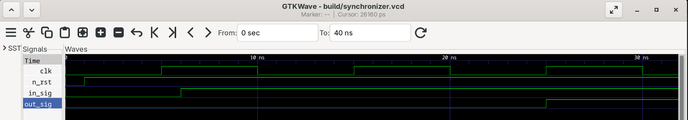
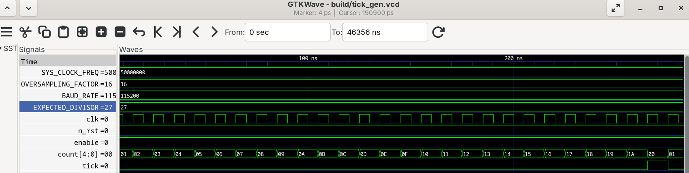
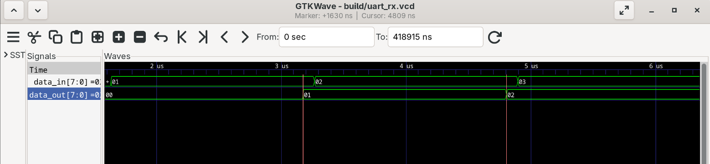

# SystemVerilog RTL Labs

A collection of small SystemVerilog RTL design labs focused on building, simulating, and verifying digital hardware modules from first principles.

This repository documents my progression through core RTL concepts including combinational logic, sequential logic, counters, synchronizers, testbenches, waveform inspection, and simulation-driven verification.

## Overview

The goal of this repository is to practice writing clean, synthesizable SystemVerilog and validating each design using simple testbenches and waveform analysis.

Each lab generally includes:

- RTL design files written in SystemVerilog
- A corresponding SystemVerilog testbench
- Simulation output using Icarus Verilog
- Waveform inspection using GTKWave
- Screenshots of important timing behavior

## Repository Structure

```text
SystemVerilog-RTL-Labs/
├── rtl/
│   └── <block_name>/
│       └── <module_name>.sv
├── tb/
│   └── <block_name>/
│       └── tb_<module_name>.sv
├── scripts/
│   └── <simulation scripts>
├── photos/
│   └── <waveform screenshots>
└── README.md
```

## Tools Used

- **SystemVerilog** — RTL design and testbench development
- **Icarus Verilog** — Compilation and simulation
- **GTKWave** — Waveform viewing and debug
- **Bash** — Simple simulation automation

## Running a Simulation

The repository includes a compile/run script that expects the test/module name and block folder as arguments.

### General Format

```bash
./scripts/run_test.sh <TEST_NAME> <BLOCK_NAME>
```

### Example

```bash
./scripts/run_test.sh synchronizer synchronizer
```

The script compiles the following files:

```text
rtl/<BLOCK_NAME>/<TEST_NAME>.sv
tb/<BLOCK_NAME>/tb_<TEST_NAME>.sv
```

Then it runs the simulation using `vvp` and opens the waveform in GTKWave.

## Labs / Modules

### Synchronizer

The synchronizer lab demonstrates how a two-flip-flop synchronizer can be used to bring an asynchronous input signal into a clocked domain.

#### Key Concepts

- Sequential logic
- Flip-flops
- Clock-domain synchronization
- Reset behavior
- Simulation timing
- Waveform-based verification

### Tick Generator / Counter

The tick generator lab demonstrates counter-based timing logic, where a `tick` output is asserted after a programmed count interval.

#### Key Concepts

- Counters
- Enable-controlled sequential logic
- Terminal count detection
- One-cycle pulse generation
- Reset behavior
- Testbench-based verification

## Waveform Verification

Waveform screenshots are included in the `photos/` folder to show important simulation behavior. Each waveform is used to confirm that the RTL behaves correctly over time.

### Synchronizer Waveform



#### What this waveform shows

This waveform shows the behavior of the clock, reset, asynchronous input signal, and synchronized output signal. 

The important signals are:

- `clk`: The system clock driving the flip-flops
- `n_rst`: Active-low reset
- `in_sig`: Input signal entering the synchronizer
- `out_sig`: Output signal after passing through the two-flip-flop synchronizer

#### Why this behavior is correct

The output signal `out_sig` is buffered by ~20 ns which is twice the clock period of 10 ns. Since this is a 2-flop synchronizer, the input signal gets sampled not on the first rising clock edge after, but rather the second due to their being 2 connected flip flops. We can see that at 6 ns `in_sig` rises from 0 to 1. This is 1 ns after the first rising clock edge (at 5ns). 2 clock cycles later, at 25 ns, another rising edge occures which is when the out_sig waveform sees the new value of in_sig and rises to 1. 

Synchronizers are useful when crossing clock domains because the buffered flip flop design can prevent the FPGA from sampling while an input is changing. 

### Tick Generator / Counter Waveform



#### What this waveform shows

This waveform shows the counter value, enable signal, and `tick` output.

When `enable` is active, the counter increments on each clock edge. Once the counter reaches the terminal count, the `tick` output is asserted.

#### Why this behavior is correct

`EXPECTED_DIVISOR` was calculated using the other constants as 27. This means the tick needs to be generated every 27 clock cycles. Since the counter is incrementing on each clock edge (from the image `count` follows `clk` with very little delay) once it reaches 0x1A = 0d26 then 27 clock cycles from 0-26 have elapsed and the tick is generated. This is why tick goes high immediately after 0x1A. 

### UART Receiver (RX) Waveform



#### What this waveform shows

This waveform shows that `data_out` follows `data_in` and the `data_out` period correctly accounts for 16x oversampling.

#### Why this behavior is correct

The module uses clock period of 10 ns, `OVERSAMPLE_RATE` of 16, and `DATA_FRAME_LENGTH` of 8 (plus 1 start bit, 1 stop bit, no parity). Therefore, each bit should last for 16 * 10 * 10 ns = 1600 ns. From the waveform we can see that the markers are placed roughly 1630 ns apart (see the top of the graph). The extra +30 ns is likely due to marker placement. `data_out` also follows `data_in` but is buffered by 9-10 clock cycles. This is because the receiver is sampling in the middle of the stop bit and once it sees a logic high value it moves on to the DONE state rather than waiting for the full bit time period. 

## Verification Approach

The testbenches are written to exercise important behavior such as:

- Reset conditions
- Normal operation
- Enable/disable behavior
- Timing across clock edges
- Expected output transitions
- Edge cases around counter rollover or signal changes

Waveforms are used alongside automated checks to visually confirm timing behavior and make debugging easier.

## What I Learned

Through these labs, I practiced:

- Writing synthesizable SystemVerilog modules
- Separating RTL from testbench code
- Using `always_ff` for sequential logic
- Understanding nonblocking assignments
- Debugging timing behavior in GTKWave
- Structuring a basic RTL project
- Automating simulation with shell scripts
- Reading waveforms to verify hardware behavior

## Notes

This repository is intentionally focused on small, clear RTL blocks rather than large designs. The goal is to build strong fundamentals before moving into larger FPGA/ASIC-style projects.
